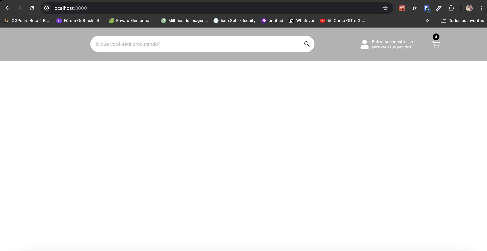
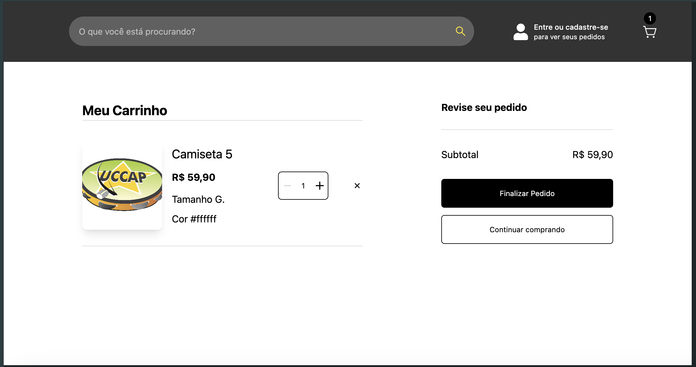
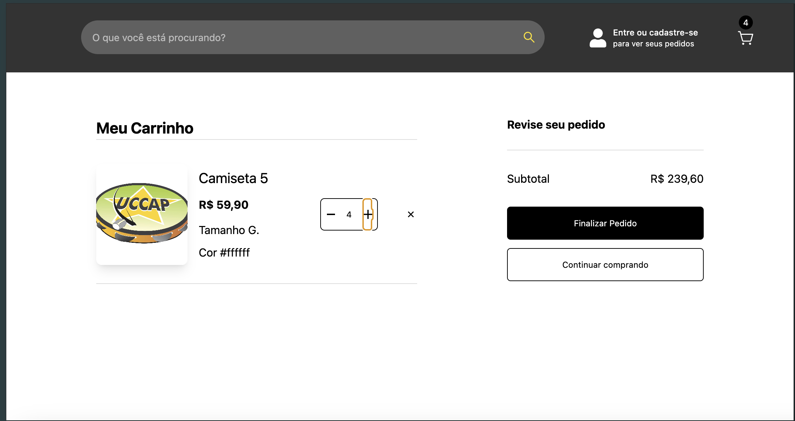
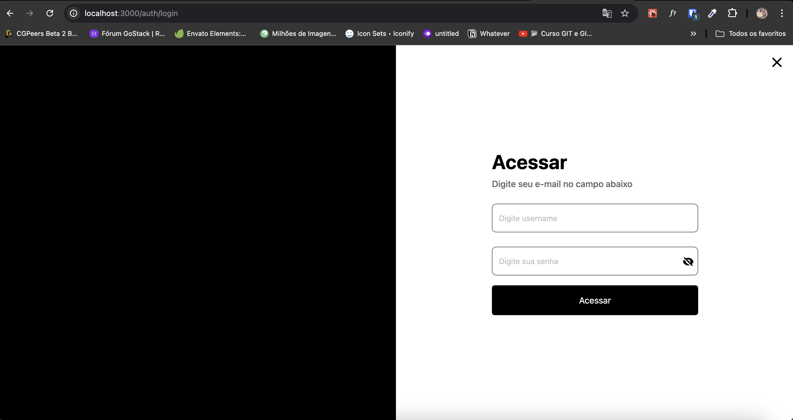
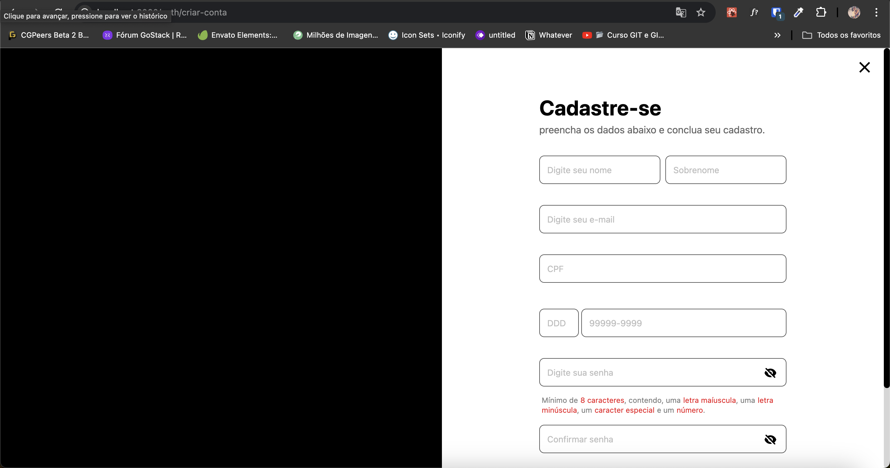

<p align="center">
  Projeto teste carrinho
</p>

<div align="center">
    
    <a href="https://www.linkedin.com/in/josewportomarinhojr/" target="_blank" rel="josewportomarinhojr">
      
    </a>
    
  </p>
</div>

<p align="center">
    <a href="README.md">English</a>
    ·
    <a href="README-pt.md">Português</a>
 </p>


<p align="center">Neste projeto, mostramos funcionalidades de um e-commerce, envolvendo carrinho e sua manipulação dentro do projeto, abordando alguns conceitos de estruturação e componentização. Utilizamos 'https://fakestoreapi.com/docs' como base.
</p>


# :camera: Telas
<div align="center">
   
   
   
   
   
</div>


# :rocket: Tecnologias
Este projeto foi realizado utilizando as seguintes tecnologias:

* [React](https://reactjs.org/)
* [Next.js](https://nextjs.org/)
* [Tailwindcss](https://tailwindcss.com/)
* [TypeScript](https://www.typescriptlang.org/)
* [React-Hook-Form](https://www.react-hook-form.com/)
* [Zod](https://zod.dev/)
* [Zustand](https://zustand.docs.pmnd.rs/getting-started/introduction)
* [Radix](https://www.radix-ui.com/)
* [Axios](https://github.com/axios/axios)

# :computer: Como rodar

```bash
# Clone o Repositório
$ git clone https://github.com/josewmarinho/cart-test.git && cd ig-news

# Instale Dependências
$ npm install

# Preencha o arquivo ".env.local" com SUAS variáveis de ambiente, de acordo com arquivo ".env.example".

# Rodando Aplicação
$ npm run dev
```
Vai para http://localhost:3000/ para ver o aplicativo em execução.


# :closed_book: Licença

Lançado em 2024 :closed_book: Licencia

Feito por [José Wellington](https://github.com/josewmarinho) 🚀.
Esse projeto esta sobre [MIT license](./LICENSE).